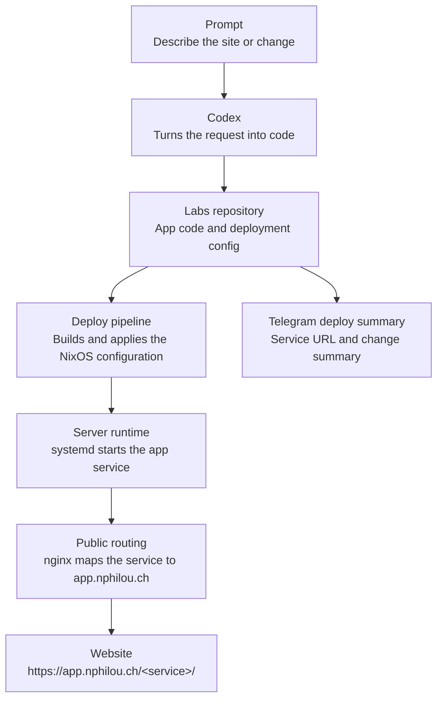

# nphilou/labs

## Architecture



## Resend deploy notification

A helper script is included to send a deployment email with the app URL.

### 1) Install dependency

```bash
pip install resend python-dotenv
```

### 2) Configure secrets on server

Create `/var/lib/labs/secrets/resend.env`:

```bash
sudo install -d -m 700 /var/lib/labs/secrets
sudo tee /var/lib/labs/secrets/resend.env >/dev/null <<'EOF'
# Replace re_xxxxxxxxx with your real Resend API key.
RESEND_API_KEY=re_xxxxxxxxx
DEPLOY_NOTIFY_TO=your-email@example.com
DEPLOY_NOTIFY_FROM=onboarding@resend.dev
EOF
sudo chmod 600 /var/lib/labs/secrets/resend.env
```

### 3) Send email

```bash
python scripts_send_deploy_email.py hello
```

You can also point to a different env file:

```bash
python scripts_send_deploy_email.py hello --secrets-file /path/to/resend.env
```

This sends a message with link: `https://app.nphilou.ch/hello`.


## Apps

- `hello`: static HTML at `https://app.nphilou.ch/hello`
- `hello-stefan`: static HTML greeting Stefan at `https://app.nphilou.ch/hello-stefan`
- `apartment-tracker`: Streamlit apartment search tracker at `https://app.nphilou.ch/apartment-tracker`
- `streamlit-basic`: Streamlit demo at `https://app.nphilou.ch/streamlit-basic`
- `buyvsrent`: Vaud buy-vs-rent Streamlit simulator at `https://app.nphilou.ch/buyvsrent`
- `liana`: minimalist artist and ceramist portfolio at `https://app.nphilou.ch/liana`

## Service ports

Labs app service ports are assigned in `nixos/ports.nix`. The NixOS module
asserts that all assigned ports are unique, so `nixos-rebuild` fails during
evaluation if a new app reuses an existing port.
