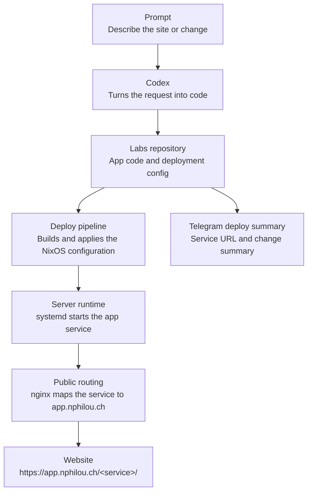

# nphilou/labs

## Architecture



## Resend deploy notification

A helper script is included to send a deployment email with the app URL.

### 1) Install dependency

```bash
pip install resend python-dotenv
```

### 2) Configure secrets on server

Create `/var/lib/labs/secrets/resend.env`:

```bash
sudo install -d -m 700 /var/lib/labs/secrets
sudo tee /var/lib/labs/secrets/resend.env >/dev/null <<'EOF'
# Replace re_xxxxxxxxx with your real Resend API key.
RESEND_API_KEY=re_xxxxxxxxx
DEPLOY_NOTIFY_TO=your-email@example.com
DEPLOY_NOTIFY_FROM=onboarding@resend.dev
EOF
sudo chmod 600 /var/lib/labs/secrets/resend.env
```

### 3) Send email

```bash
python scripts_send_deploy_email.py hello
```

You can also point to a different env file:

```bash
python scripts_send_deploy_email.py hello --secrets-file /path/to/resend.env
```

This sends a message with link: `https://app.nphilou.ch/hello`.


## Apps

- `hello`: static HTML at `https://app.nphilou.ch/hello`
- `hello-stefan`: static HTML greeting Stefan at `https://app.nphilou.ch/hello-stefan`
- `apartment-tracker`: Streamlit apartment search tracker at `https://app.nphilou.ch/apartment-tracker`
- `streamlit-basic`: Streamlit demo at `https://app.nphilou.ch/streamlit-basic`
- `buyvsrent`: Vaud buy-vs-rent Streamlit simulator at `https://app.nphilou.ch/buyvsrent`
- `liana`: minimalist artist and ceramist portfolio at `https://app.nphilou.ch/liana`
- `tgtg`: Too Good To Go API browser at `https://app.nphilou.ch/tgtg`

## Too Good To Go monitor

The `tgtg` app also includes a Go systemd timer backed by
[`tgtg-go`](https://github.com/mikispag/tgtg-go). It checks Cote Sushi item
`1198174` every 20 minutes with a small randomized delay and automatically
manages the DataDome cookie used by Too Good To Go. It sends a Telegram message
when at least 3 paniers are available and the price is below 11 CHF.
The monitor checks the current Android app version daily and uses a modern
Android 17 identity plus the Android consumer request headers. Version 26.9.4
is the fallback when discovery is unavailable. Override `TGTG_USER_AGENT` and
`TGTG_APK_VERSION` together if TGTG changes this again.

Create `/var/lib/labs/secrets/tgtg-monitor.env` on the server:

```bash
sudo install -d -m 700 /var/lib/labs/secrets
sudo tee /var/lib/labs/secrets/tgtg-monitor.env >/dev/null <<'EOF'
TGTG_ACCESS_TOKEN=...
TGTG_REFRESH_TOKEN=...
# Optional, if reusing an existing session cookie:
# TGTG_COOKIE=...
TELEGRAM_BOT_TOKEN=...
TELEGRAM_CHAT_ID=...
EOF
sudo chmod 600 /var/lib/labs/secrets/tgtg-monitor.env
```

## Service ports

Labs app service ports are assigned in `nixos/ports.nix`. The NixOS module
asserts that all assigned ports are unique, so `nixos-rebuild` fails during
evaluation if a new app reuses an existing port.
